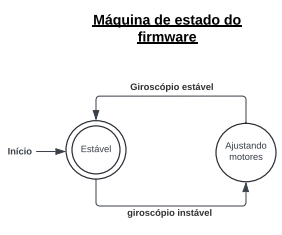

# Projeto Sistemas Embarcados 2024.1

## Componentes Utilizados

- 1x ESP32 + Fonte (5V)
- 1x Sensor MPU6050
- 2x Servomotores

##  Sobre o Projeto

O objetivo é unir as bibliotecas do servomotor e do sensor MPU6050 feitas anteriormente para construção de uma aplicação que executa o ajuste de angulação dos servomotores com base na variação do giroscópio do sensor MPU6050.

### Estrutura do github do projeto final

```txt
components/
    imu_tools/
        include/
            imu_tools.h
        CMakeLists.txt
        imu_tools.c
    mpu6050_driver/
        include/
            mpu6050_driver.h
        CMakeLists.txt
        mpu6050_driver.c
    sensor_imu/
        include/
            sensor_imu.h
        CMakeLists.txt
        sensor_imu.c
    servo_hw/
        include/
            servo_hw.h
        CMakeLists.txt
        servo_hw.c
    servo_tools/
        include/
            servo_tools.h
        CMakeLists.txt
        servo_tools.c
main/
    CMakeLists.txt
    main.c
CMakeLists.txt
diagram.json
sdkconfig
sdkconfig.old
README.md

```

## Máquina de Estados



## Diagrama de Bloco do Protótipo do Hardware


## Esquemático do Hardware


## Arquitetura


## Demonstração


## Relatório do Projeto Final

Utilizamos as bibliotecas do [grupo 6 para o sensor](https://github.com/luizh-silva-oliveira/projeto-sistemas-embarcados?authuser=0) e do [grupo 4 para o servomotor](https://github.com/henrique-lh/Projeto-sistemas-embarcados?authuser=0).

Não tivemos problemas para trabalhar com elas.
